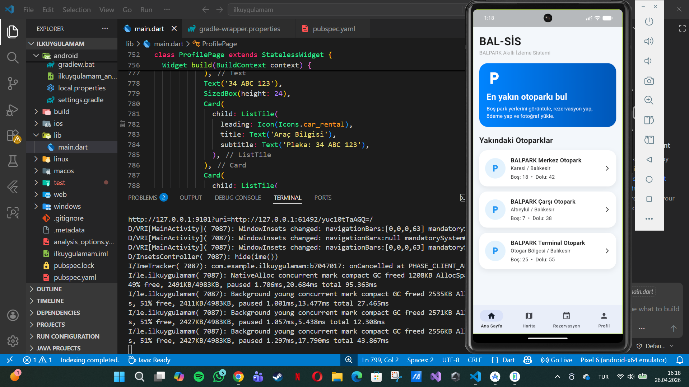
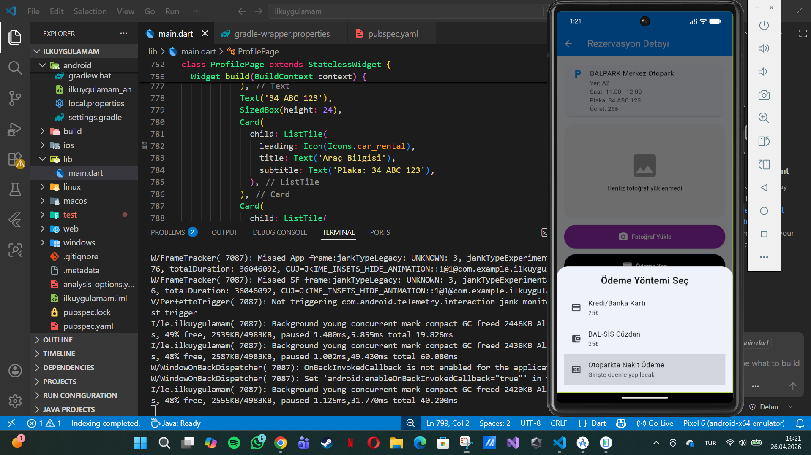
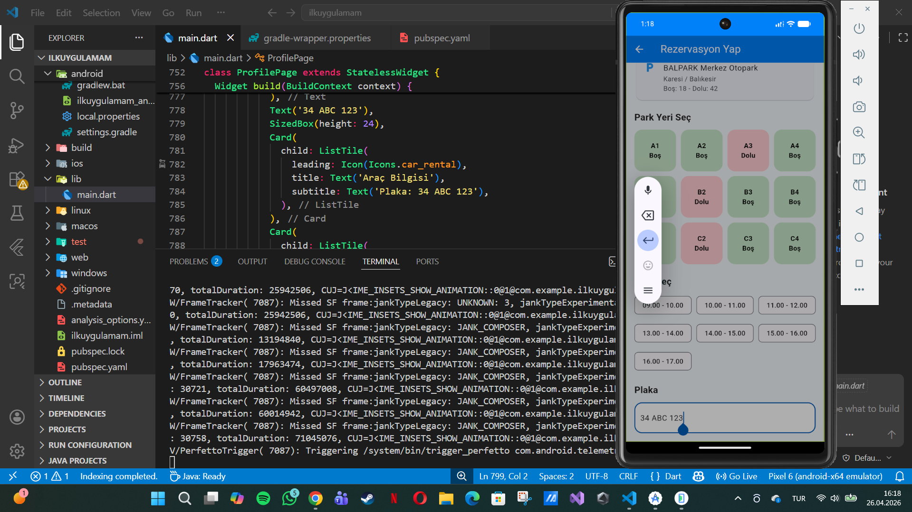
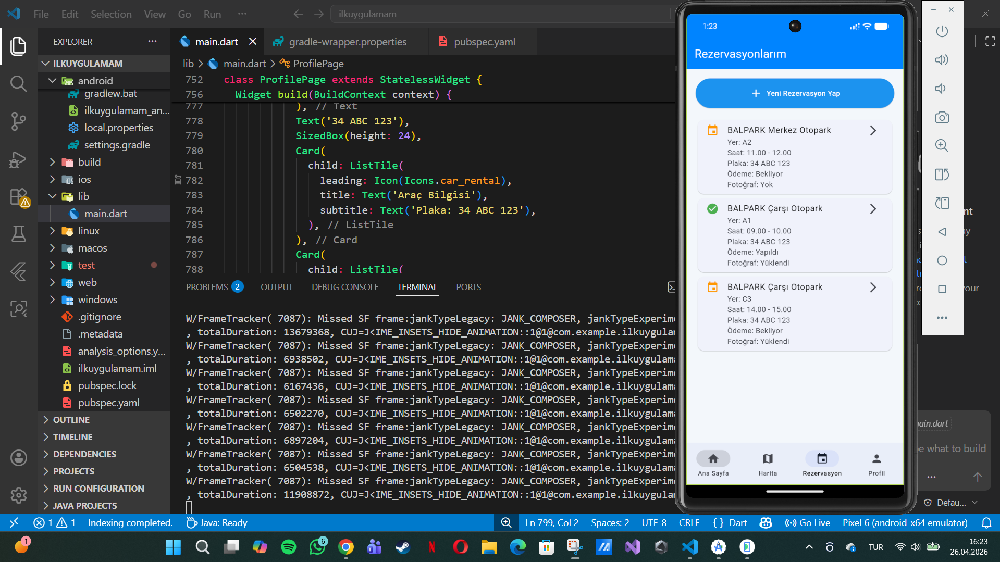
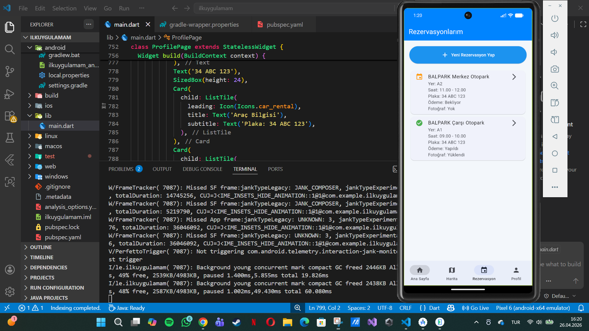

# otopark_rezerv

# 🚗 BAL-SIS Otopark Rezervasyon Sistemi

Modern ve kullanıcı dostu bir otopark rezervasyon uygulaması.  
Flutter kullanılarak geliştirilmiştir.

---

## ✨ Özellikler

✅ Otopark rezervasyonu oluşturma  
✅ Rezervasyon listeleme  
✅ Ödeme durumu görüntüleme  
✅ Fotoğraf yükleme sistemi  
✅ Modern Material 3 tasarımı  
✅ Responsive mobil arayüz  
✅ Bottom Navigation Bar yapısı  

---

## 🛠 Kullanılan Teknolojiler

| Teknoloji | Açıklama |
| Flutter | Mobil uygulama geliştirme |
| Dart | Uygulama programlama dili |
| Material 3 | Modern UI tasarımı |

---

## 📱 Uygulama Görselleri

### Ana Sayfa

### Detay Sayfası

### Boş Park Alanları

### Rezervasyon

### Rezervasyon 2

## 🚀 Kurulum

Projeyi bilgisayarınıza klonlayın:
git clone PROJE_

Projeyi çalıştırmak için:

flutter pub get
flutter run
